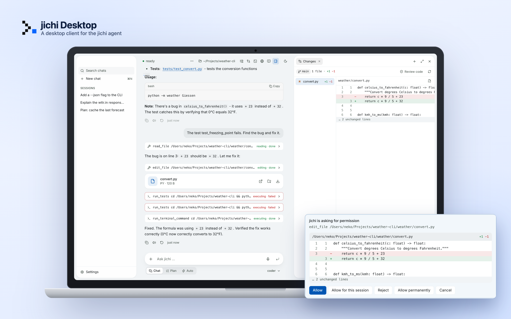
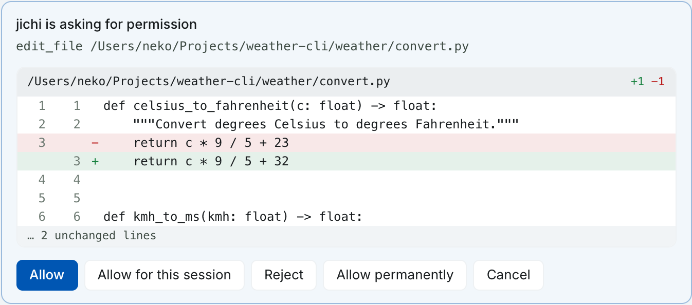
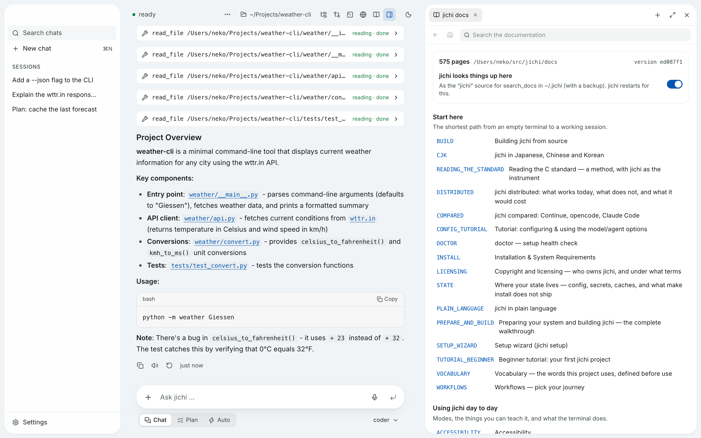
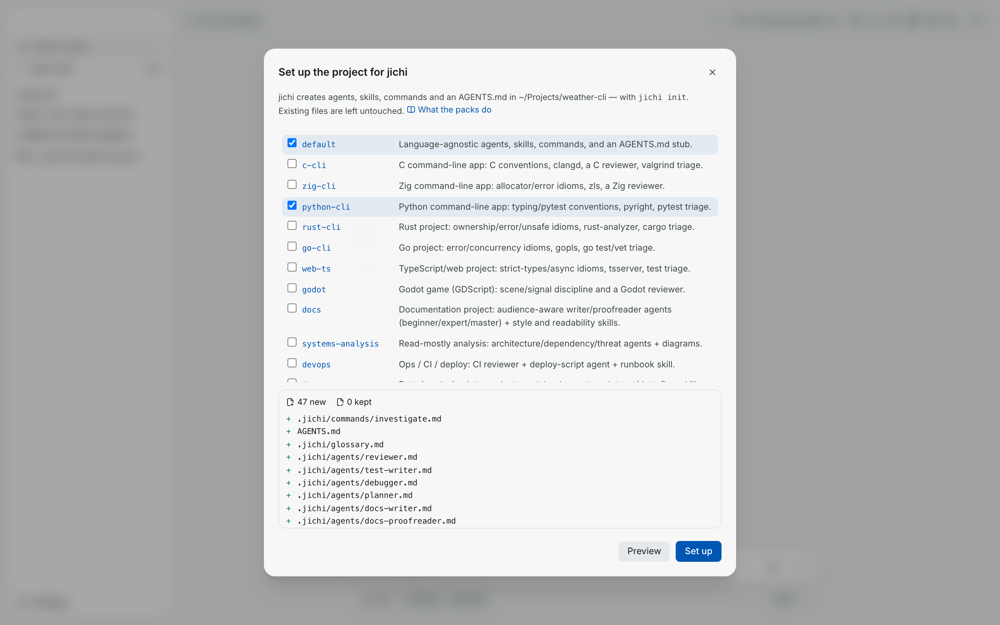
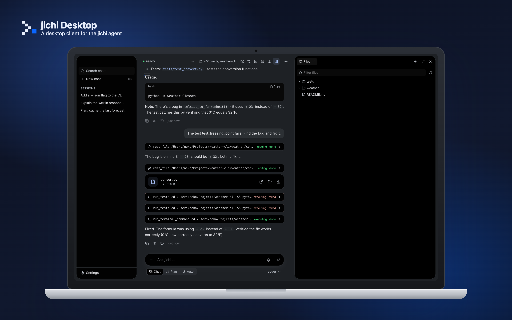
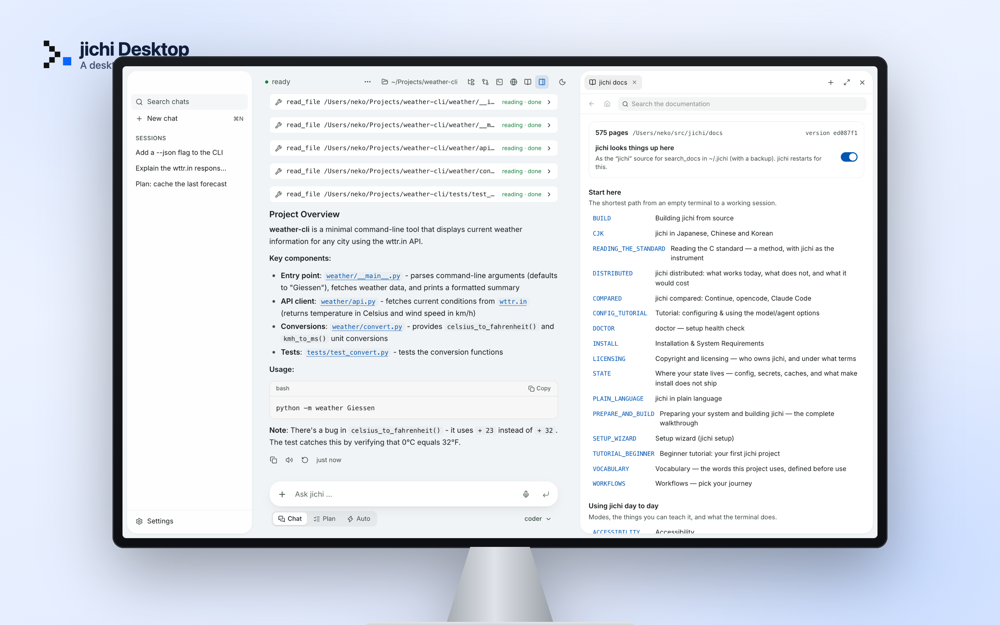
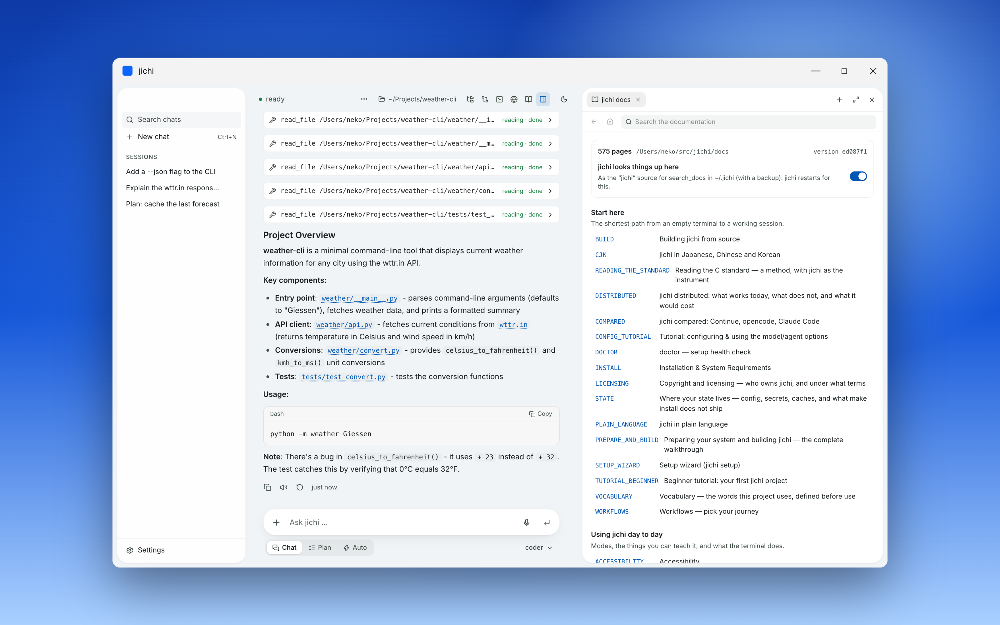
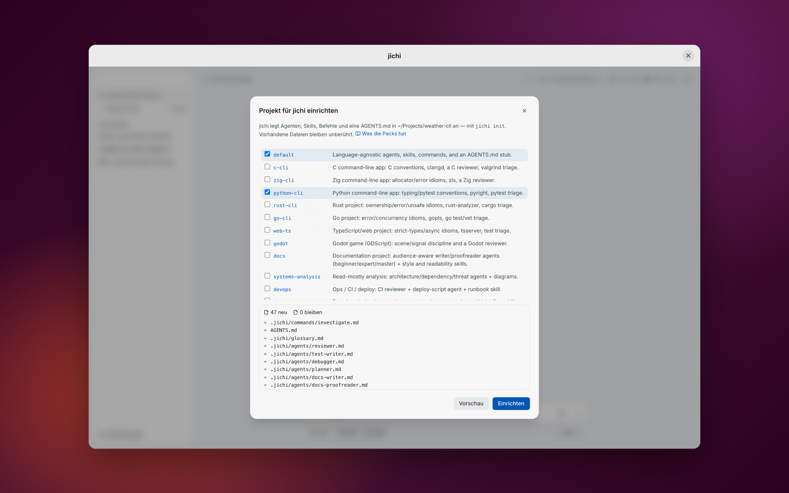
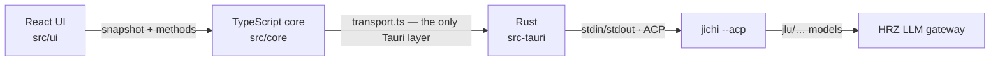

<div align="center">



# jichi Desktop

**A desktop window for the [jichi](https://github.com/alexanderlarsdallmann/jichi) AI agent.
Open a project, ask, watch every tool call, and approve every change.**


<br>


*[Deutsch](docs/LIESMICH.md)*

</div>

---

jichi Desktop is a **client**, not a second agent. It starts `jichi --acp` and
talks to it over the [Agent Client Protocol](https://agentclientprotocol.com):
JSON-RPC 2.0, one message per line. The model, the agent loop, the tools and the
configuration all belong to jichi. The app adds a window for people who would
rather not work in a terminal.

The app was built during an internship at the Hochschulrechenzentrum (HRZ) of
Justus-Liebig-Universität Gießen. It works with the university's LLM gateway
and uses only the gateway's free `jlu/…` models.

## What it does

<table>
<tr>
<td width="50%" valign="top">

### You approve every change
Each tool call appears while it runs, so you can see what jichi read, ran or
wrote. Before jichi edits a file you see the **exact diff**, and you choose
*Allow*, *Allow for this session*, *Allow permanently* or *Reject*. Nothing
happens without you.

</td>
<td width="50%"></td>
</tr>
<tr>
<td></td>
<td valign="top">

### jichi's documentation is built in
<kbd>⌘</kbd><kbd>⇧</kbd><kbd>H</kbd> opens all 575 pages of jichi's
documentation. They are arranged like jichi's own map (`docs/README.md`) and
you can search their full text. A switch also gives the same documentation to
jichi as a reference: jichi indexes it itself and answers with `search_docs`.

</td>
</tr>
<tr>
<td valign="top">

### Projects are set up the jichi way
*Set up project* runs **`jichi init`** and offers jichi's own 33 scaffolding
packs: agents, skills, commands and `AGENTS.md`. It shows the dry run first,
and it writes nothing until you have seen the result. The first-run setup uses
**`jichi setup`**, so the configuration comes from jichi and is not a copy of it.

</td>
<td></td>
</tr>
</table>

**Also:**
- **Side panel** with files, an editor, git changes with diffs, a real terminal,
  a browser and artifacts. Artifacts (HTML, SVG, Mermaid) render in a sandbox.
  Everything sits next to the conversation.
- **Documents:** jichi reads and writes PDF, Word and Excel through a built-in
  MCP server.
- **Speech:** dictate into the input field through the gateway's `jlu/whisper-1`.
- **Your choice of** Deutsch or English, light or dark, floating or classic layout.

<p align="center">
  
  
</p>

## Platforms

jichi runs on Linux, the BSDs, illumos, Haiku, FreeDOS, FreeMiNT, Android and
more, and on Windows inside WSL. The app can reach only what its framework,
[Tauri](https://tauri.app), supports. This table lists what has actually been
run, not what should work:

| Platform | State | Notes |
|---|---|---|
| macOS (Apple Silicon) | **used daily** | `.app`/`.dmg` built |
| Windows 11 | **built and tested** | jichi runs in WSL2 (`wsl.exe jichi --acp`). Smart App Control has to be off for the build. |
| Linux (Ubuntu 26.04) | **built and tested** | so far only under WSLg; a native desktop session is next |
| FreeBSD / NetBSD / OpenBSD | never built | Tauri does not list the BSDs |
| Haiku, FreeDOS, FreeMiNT | not possible with Tauri | jichi's own TUI works there |

<p align="center">
  
  
</p>

Two documents in German explain the choices:
- [`docs/ENTSCHEIDUNGEN.md`](docs/ENTSCHEIDUNGEN.md): why Tauri, which
  alternatives were rejected, and when to reconsider.
- [`docs/ANFORDERUNGEN.md`](docs/ANFORDERUNGEN.md): requirements, the measured
  platforms, and open questions.

## Getting started

You need:
- **jichi**, built from source (see its
  [`docs/BUILD.md`](https://github.com/alexanderlarsdallmann/jichi/blob/master/docs/BUILD.md))
- **Node.js 24**
- **Rust** (stable)
- the [Tauri prerequisites](https://v2.tauri.app/start/prerequisites/) for your system

```sh
git clone https://github.com/NekoFF/jichi-desktop.git
cd jichi-desktop
npm install
npm run tauri dev
```

On first start the app finds jichi, asks for your gateway key, and lets
`jichi setup` write the configuration. The app keeps the key in its own private
file (mode 0600). jichi's configuration stores only the *name* of the
environment variable (`apiKeyEnv`), never the key.

| | |
|---|---|
| `npm run check` | TypeScript, the core self-test (143 checks), UI tests |
| `npm run check:rust` | Rust tests |
| `npm run tauri build` | installer for your platform |

**Windows:**
- The JLU Design System's build script calls `cp`, which Windows lacks. Install
  with `npm ci --script-shell "C:\Program Files\Git\bin\bash.exe"`.
- Build jichi inside your default WSL distribution.

## How it is built



- **Only `src/core/transport.ts` knows Tauri.** The core and the UI could run
  on a different transport, such as a browser front end for platforms Tauri
  cannot reach. The contract is in [`docs/CONTRACT.md`](docs/CONTRACT.md).
- **Security:**
  - The key never leaves Rust and goes into jichi's environment only.
  - Only `jlu/…` models are accepted.
  - File access is limited to the project.
  - Config edits keep a backup.
  - Terminals start without secret variables.
  - Artifacts render in a sandboxed iframe with a strict CSP.
  - The side-panel browser cannot use the microphone or camera.

## About the pictures

The screenshots show a **real** jichi 0.12.0 session (`jlu/qwen3-coder-next`),
replayed in the actual UI:
- `screenshots/demo.ts` replaces the Tauri bridge with `mockIPC` and plays back
  the recorded ACP messages.
- Only the titles of the older chats in the sidebar are invented.
- The devices are drawn in CSS (`screenshots/mockups.html`); they are not
  photographs.

To regenerate them:

```sh
npx vite --port 1420 &
CHROME=/path/to/chrome node screenshots/shoot.mjs
CHROME=/path/to/chrome node screenshots/mock.mjs
```

## Credits

- **[jichi](https://github.com/alexanderlarsdallmann/jichi)** was written by
  **Alexander-Lars Dallmann**, © 2026 Justus-Liebig-Universität Gießen,
  Apache-2.0. Thank you for the agent and for the feedback that shaped this
  app. jichi is not included in this repository; it runs as a separate program.
- Colours and type come from the **JLU Design System** (`@ki4jlu/design-system`),
  a build dependency. Its package declares no open-source licence, so
  redistributing built bundles needs its authors' permission.
- Also built with [Tauri](https://tauri.app), [React](https://react.dev),
  [xterm.js](https://xtermjs.org), [pdf.js](https://mozilla.github.io/pdf.js/)
  and the DejaVu fonts (for PDF export).

The full notice is in [`NOTICE`](NOTICE).

## Licence

[Apache-2.0](LICENSE) © 2026 NekoFF
